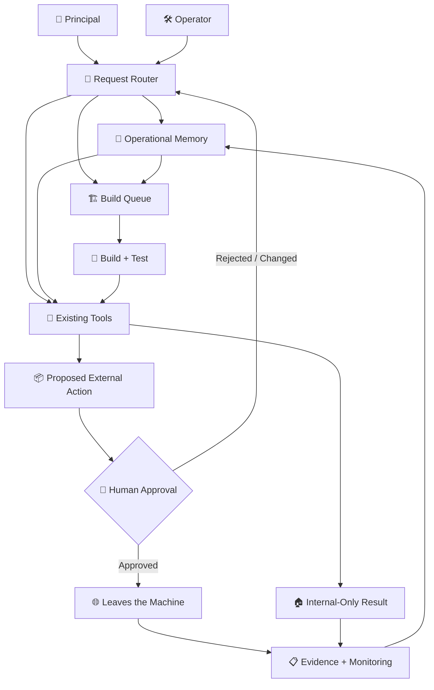

<div align="center">

# 🧠 Corp

**An always-on AI operations layer for a real-world, industry-leading business.**


*Build AI systems that can do useful work without giving them permission to quietly do the wrong thing.*

</div>

---

## 🏢 What this project is

Corp is an always-on AI operations layer built for a real-world, top-performing insurance agency inside a national carrier's captive network.

It is not a chatbot.

It is not an autonomous employee.

It is a system with memory, routing, tools, tests, approval gates, and monitoring, running unattended on a Windows machine inside the client's own environment.

There are two users.

**The principal** runs the business. They talk to the system in plain language, usually from a phone. They do not need to know a command, remember a syntax, choose a model, or understand how the underlying system works.

**The operator** owns the technical side. The operator reviews builds, controls deployment, owns credentials, investigates failures, and controls every exception to the system's safety rules.

Those roles are intentionally different.

The principal should be able to ask for outcomes.

The operator should be able to inspect exactly how those outcomes are produced.

This repository is a sanitised public case study of that architecture. The production vault, business data, credentials, internal records, prompts containing sensitive context, and client-specific integrations remain private.

The client and carrier are **[CONFIDENTIAL]**.

---

## 🗺️ The system at a glance



The important boundary is not between "AI" and "software."

It is between **preparation and consequence**.

The system can reason, retrieve context, prepare work, test tools, and assemble exact payloads internally. Anything externally visible crosses an explicit human approval boundary before it leaves the machine.

---

## 🧰 The toolkit

| | Capability | What it does |
|---|---|---|
| ⭐ | **Review operations** | Collects review context, prepares grounded responses, tracks handling, and keeps the final external action behind approval. |
| 📧 | **Email operations** | Reads permitted inbox context, classifies work, prepares replies, extracts tasks, and routes anything consequential for review. |
| 🎯 | **Lead intelligence** | Sources prospects from public data, evaluates them against defined criteria, and measures one specific provable gap in each rather than guessing at a reason to call. |
| ✉️ | **Outbound operations** | Paces prepared messages one at a time inside working hours, tests message variants against replies, and stops the entire run the moment a human answers. |
| 📊 | **Data-to-decision reporting** | Turns operational data into summaries, exceptions, trends, and decision-ready reports instead of raw exports. |
| 👥 | **Team operations** | Tracks tasks, responsibilities, follow-ups, recurring work, and operational handoffs without requiring the principal to manage the underlying system. |
| 🔁 | **Retention and renewals** | Surfaces upcoming retention work, renewal opportunities, unresolved follow-ups, and context needed for timely intervention. |
| 💰 | **Spend analysis** | Reads what the business actually pays, works out which vendors something already built could replace, and writes the build request for the ones it cannot. |
| 🧑‍💼 | **Hiring and onboarding** | Organises applicants on identical terms, prepares interview material, tracks scheduling and no-shows, and deliberately refuses to rank anyone. |
| 📄 | **Document handling** | Classifies, extracts, routes, summarises, and retrieves documents while preserving their source and operational context. |
| 🏗️ | **Autonomous tool builder** | Turns repeated work into bounded tools through planning, implementation, adversarial review, testing, and operator-controlled deployment. |
| 🩺 | **Reliability layer** | Watches health, validates invariants, records failures, checks dependencies, and makes silent degradation visible. |

### What each one actually does

The table above is the summary. The mechanism is more specific, and the specifics are where the safety lives.

**⭐ Review operations.** A browser session, held open and signed in, reads new public reviews on a poll. Each one is matched against a roster so a staff member named in a review can be named in the reply, and against the review text itself so nothing in the response asserts a fact the customer did not state first. The draft is written in the principal's voice, learned from her own previous replies rather than from a template. Then it stops.

This is the one place in the system with an armed automatic path, and it was armed deliberately, by hand, after months of drafts being read and approved one at a time. Clean drafts at four stars or above publish themselves ninety minutes after a review is found. Anything flagged, anything negative, anything below that rating still waits for a person. The delay is not a technical requirement; it is a window in which a human can stop it.

**📧 Email operations.** Reads a permitted mailbox over IMAP, classifies what actually needs attention, and writes a reply into the drafts folder.

There is no send path. Not a disabled one, not a flag, not a configuration setting — **the package contains no mail-sending library at all**, and a test walks its syntax tree on every run to prove it. A tool that could send and merely chose not to would be one mistake away from a customer receiving something nobody read.

**🎯 Lead intelligence.** Sources prospects from public data, scores them against written criteria, and records why each one qualified or did not. The reasoning is stored alongside the score, because a number with no argument behind it cannot be checked later and cannot be corrected.

**🔁 Outreach sequencing.** Multi-touch follow-up with hard stops: a maximum number of touches, business hours only, and a reply, bounce or opt-out closes the sequence permanently and irreversibly. Templates are approved by hash — editing one un-approves it automatically and the tool then stages nothing rather than sending unreviewed wording.

The single write it performs anywhere is appending a draft to the drafts folder, flagged as a draft. That is checked structurally: exactly one such call may exist in the package, its folder must come from the drafts lookup rather than any name that could be anything, and it must carry the draft flag. A message appended to a sent folder would read as sent to a human looking at their mailbox, and that is the failure the check exists to catch.

**📊 Data-to-decision reporting.** Turns operational data into exceptions and trends rather than exports. Renders worksheets to images without spreadsheet software, because the machine it runs on does not have any installed and waiting for a licence was not a reason to have no reports.

**👥 Team operations.** Tasks addressed to people by name, never by role — an instruction that reads "the receptionist should" is one nobody owns. Tracks follow-ups and recurring work without requiring the principal to administer the system underneath it.

**🧑‍💼 Hiring operations.** Applications arrive on their own: a read-only mailbox watcher recognises application-shaped mail from job boards or direct applicants and hands each one to the hiring desk with a source label, deduplicated so a rerun never creates a second copy of the same person. From there every applicant gets one summary in exactly the same shape, and every fact in it is a line the candidate wrote, quoted, with the file and line it came from. A field with nothing behind it reads `NOT FOUND`, which means the scan found no statement about it rather than that the person lacks it, and the summary says so at the top in those words.

It does not score, rank, compare, or recommend anybody, and it cannot contact an applicant at all.

That restraint is the most deliberate design decision in the system, and it is not squeamishness. The state's law against discrimination binds at the employer's headcount, and federal uniform guidelines put validation liability for any selection procedure on the employer personally. The screening step already running before this tool existed was a vendor's timed test published with no validation study and no adverse impact analysis, and that exposure belonged to the principal either way. A tool that only organises is measurably **less** exposed than the status quo it replaces, which is an unusual thing to be able to say about adding automation to hiring.

The question set is checked on every single load and refuses to run if it grows a question about criminal history or any protected characteristic. The check is a keyword list and not a lawyer, and the file says exactly that in its own header, because a guardrail that oversells itself is worse than one that states its limit.

The value is not only the four vendor bills it replaces. It is that five candidates get compared on the same basis, in the same order, instead of from memory a week later. That is both a better hire and a defensible one.

**💰 Spend analysis.** Reads a card or bank export, works out what the business is genuinely paying, cross-references every vendor against the tools already built and the requests already queued, and writes a build request for anything replaceable that does not exist yet. It writes the request. It does not run the builder, and it decides nothing.

The interesting part is the class of spend it exists to catch. A vendor billing a fixed amount on a fixed day is trivial, and everybody already knows about those. The expensive ones bill as irregular top-ups and never look like subscriptions at all, so they survive every "list what you pay for" exercise ever run. In the first real pass, three vendors in that shape were costing more per month than the largest line anybody had on a list, and none of them appeared on any list anywhere. A bundled service recorded in six separate places at one figure turned out to be a third less than that figure. Two vendors formally decided against weeks earlier were still billing, because the decisions had been made and never executed.

It cannot cancel, contact, pay, or dispatch anything; it reads files and writes files. An unrecognised merchant reads `UNIDENTIFIED` with its raw descriptor rather than a plausible guess, because a confidently wrong answer about where money goes is worse than an obvious gap. A vendor that already stopped billing is reported as stopped and excluded from the headline total, since a saving counted twice is the same failure as a number quoted from memory.

The first pass of this analysis was done by hand and took an afternoon. It found that roughly **half of one card's annual outside spend** was replaceable, already replaced, or buying nothing at all. The finding that mattered most was not any individual vendor. It was that decisions already taken had never actually reached the account.

**🩺 Reliability layer.** Checks run on every interaction and write a short standing brief: what is stale, what is armed, what is running code older than the code on disk, and what number is currently impossible. That last category matters — a metric returning a conversion rate above 100% is listed by name as unquotable rather than quietly reported.

**🧠 Knowledge graph.** Code and operational notes indexed into one structure — several thousand nodes across functions, docstrings, concepts and written decisions. It answers "what calls this", "what breaks if I change it" and "which note explains why this exists" without a text search.

It is also a cautionary tale. It was eleven times larger until a vendored database admin tool was excluded from indexing: 87% of the graph was somebody else's bundled JavaScript, and the honest answer to "what is the most called function in this system" was minified vendor code with thirteen thousand callers, while the real answer had thirty-four. A knowledge graph that indexes everything knows nothing in particular.

The point is not to have the largest toolkit.

The point is to make recurring work **explicit, inspectable, and recoverable**.

---

## 🎯 Finding people, and reaching them

Two capabilities that only became one thing once they were built next to each other.

### Measuring a reason to call

Sourcing a list is easy and worth very little. **18,648 businesses** in one
vertical were indexed from public data with 21,410 supporting observations, which
on its own is a spreadsheet nobody will use.

What makes it a lead is measuring **one specific, provable, checkable fact** about
each prospect. In this case: how many of their public reviews go unanswered. 553
listings measured so far, 131 of them under a 70% reply rate. That number can be
stated in a first sentence and verified by the recipient in under a minute, which
is a different conversation from a generic pitch.

**The finding that changed how the tool is used.** The median reply rate across
all 553 measured is **92%**. These businesses are good at this. The gap is a
filter for finding the few, not a description of the market, and any material
implying otherwise would be false. A lead tool that cannot tell you its own
opening is unrepresentative is a tool that will embarrass you in front of a
prospect.

### The channel that was measured wrong

Worth writing down because the mistake is easy and the correction was large.

A crawler read all 17,514 prospect websites looking for published email addresses
and found **67**, which is 0.38%. That number got quoted for a day as proof the
email channel did not exist.

Nobody had measured the **domain**. **14,827 of 17,514, or 84.7%, run their own
domain carrying their own name.** A 120 domain random sample was checked for mail
exchanger records and 120 of 120 accept mail. The address is therefore
*constructible* rather than *discoverable*, and the reachable population is **221
times** what the published count suggested.

**Two caveats travel with that number and neither is optional.** A mail exchanger
record proves a domain accepts mail; it does not prove a given local part exists.
That stays an inference until a real send measures the bounce rate. And the
sample showed every one of those domains routing through a single third party
platform, which changes what may safely be said in a message to any of them.

The general lesson: **when a measurement says a channel is dead, check what was
actually measured.** Published and reachable are different words.

### Sending, without becoming a sender

The outbound layer sends **at most one message per run** on a scheduled task, and
is stateless between runs. That is deliberate rather than simple. A long running
process that sleeps between sends dies with a reboot and holds whatever code it
started with; a task that wakes, does one thing and exits can be corrected at any
point and does the right thing on the next tick.

What it refuses to do is most of what it is:

- **Nothing at all without an approval file on disk**, which is the record that a
  person read the batch. No file, no send, and it says so and exits.
- **Nothing outside working hours in the recipient's own timezone.** Not the
  sender's. Volume is unchanged; the clock is not.
- **Never catches up.** A missed slot costs one message. Sending six at once to
  make up for it is the most machine-readable thing a mailbox can do.
- **Intervals are randomised, not clockwork**, seeded from the date so a given
  day's pattern can be reconstructed later if it ever has to be explained.
- **A reply stops everything.** Not that recipient. Everything. A reply is a
  person, and continuing to mail a list while somebody waits for an answer is the
  worst thing this could do.
- **A bounce rate above a threshold halts the campaign**, because a list of
  inferred addresses is exactly how a sending reputation gets destroyed.

### Testing the message instead of arguing about it

Three message variants run concurrently, each leading with a different angle and
**ending in a single question rather than a pitch**. The reply says which problem
the prospect actually finds annoying, in their own words, and the pitch goes into
the response to that.

This is not a style preference. 64 posts with real engagement numbers were
analysed and content carrying a pitch performed at **0.42x** the account's own
following, the worst of five angles measured, while a universal work grievance did
10.6x. A first message that pitches is measurably the weak one.

Every variant carries a postal address and a working opt-out, because commercial
mail to a stranger legally requires both, and because a complaint without them is
a real problem rather than an annoyance.

---

## 🔌 Delivering through a system you do not control

A problem worth documenting because the shape recurs: **the work was never
composition, it was delivery.**

Messages prepared on the operations machine had no route out of the business's
own corporate mailbox. Authenticated SMTP was disabled at the tenant level,
nothing could be installed on the managed laptop, and that mailbox was the only
identity the recipients would recognise.

The answer was the tenant's own sanctioned automation platform. A cloud flow
watches for a trigger message, verifies it, and sends the finished body through a
native mail API rather than over SMTP, so the disabled protocol never applies. It
is vendor-supported rather than a script on a managed device, and **nothing runs
on the laptop**, so the laptop can be closed.

Three details that cost real time and are worth stealing:

**Routing metadata rides in the subject line, never the body.** A subject is
always plain text. A body will be re-rendered as HTML the moment a mail client
feels like it, and any parsing of it breaks silently at that point.

**The gate is two independent checks and both are needed.** One filters on
sender; a separate condition verifies a shared secret. A sender header on
inbound internet mail is forgeable, which is why the secret exists. The secret
travels in clear text through the mail gateway, which is why the sender check
exists. Either alone is not a gate.

**The refusal was tested before the success, on purpose.** Wrong secret first:
the run completed in 101 ms, the send step was skipped, nothing was delivered
anywhere. Only then was a real message sent. A relay that delivers is trivially
easy to verify. A relay that correctly refuses is the half nobody checks, and it
is the half that matters.

### The bug worth admitting

The gate failed with the correct secret, and forty minutes went into the wrong
explanations. The secret had been generated by a standard URL-safe token function
and contained two capital `I` characters. Typed by hand into a browser from a
phone screen, capital `I` and lowercase `l` are the same glyph in most interface
fonts.

**Any secret a human has to retype is now generated from an alphabet with no
`I`, `l`, `1`, `O` or `0` in it.** It was not a security problem, a platform
problem or a logic problem. It was typography, and no amount of debugging the
logic was ever going to find it.

### What the relay deliberately cannot do

It cannot compose a message, alter one, or choose a recipient. It takes a
finished body that a person wrote and a person read, and it delivers it. Pacing,
follow-up timing and stop-on-reply all live on the operations machine, on the
other side of the boundary, where they can be corrected.

**Delivery and authorship are separate systems.** Collapsing them is how an
automation becomes an open relay wearing somebody else's name.


---

## 🧠 Memory is part of the product

A useful operations system cannot wake up every morning with amnesia.

Corp uses an Obsidian vault as durable operational memory. The vault holds business context, decisions, operating rules, tool documentation, evidence, and the information required to understand why the system behaves the way it does.

A simplified structure looks like this:

```text
Corp/
│
├── 00 - Start Here/
│   ├── 01 - System Map.md
│   ├── 02 - Operating Rules.md
│   └── 03 - Current Priorities.md
│
├── 01 - Business Memory/
│   ├── 01 - Business Facts.md
│   ├── 02 - Products and Services.md
│   ├── 03 - Team Roles.md
│   └── 04 - Operating Context.md
│
├── 02 - Operations/
│   ├── 01 - Reviews.md
│   ├── 02 - Email.md
│   ├── 03 - Leads.md
│   ├── 04 - Retention.md
│   └── 05 - Team Tasks.md
│
├── 03 - Tools/
│   ├── 01 - Tool Registry.md
│   ├── 02 - Permissions.md
│   └── 03 - Runbooks.md
│
├── 04 - Build Queue/
│   ├── 01 - Requests.md
│   ├── 02 - In Review.md
│   └── 03 - Evidence.md
│
├── 05 - Safety/
│   ├── 01 - Approval Rules.md
│   ├── 02 - Provenance Rules.md
│   ├── 03 - External Action Policy.md
│   └── 04 - Failure Policy.md
│
└── 06 - System/
    ├── 01 - Health.md
    ├── 02 - Change Log.md
    ├── 03 - Incidents.md
    └── 04 - Backups.md
```

Most of the value does not come from thousands of notes.

A small set does most of the heavy lifting:

- **System Map** — what exists and how the pieces connect.
- **Operating Rules** — boundaries the system is not allowed to improvise around.
- **Business Facts** — verified facts the system can rely on.
- **Tool Registry** — what each tool does, requires, and is allowed to touch.
- **Approval Rules** — which actions require a person and what exactly is being approved.
- **Change Log** — what changed, when, and why.
- **Incidents** — failures worth remembering so the system does not relearn the same lesson.

Memory is not an attachment to the system.

It is part of the system.

---

## 🛡️ The safety model

### 1. Prepare, don't dispatch

The default permission is to **prepare work, not publish it**.

Generating an email and sending an email are different capabilities.

Preparing outreach and contacting a person are different capabilities.

Producing a recommendation and changing a business record are different capabilities.

That separation is intentional.

### 2. Approval belongs to the exact payload

"Approved" is not a reusable permission.

If a human approves a specific message, recipient, attachment, or action, the approval belongs to that exact payload.

Change the payload and the approval is no longer valid.

This prevents an approval from silently becoming permission for whatever the system generates next.

### 3. Facts need provenance

Operational memory must distinguish between:

- verified business facts,
- source-derived facts,
- system observations,
- model interpretations,
- and unresolved assumptions.

When a consequential decision depends on a fact, the system should be able to answer:

**Where did this come from?**

A confident model output is not provenance.

### 4. Secrets stay local

Credentials, tokens, private business information, production configuration, and sensitive operational context do not belong in the public repository.

Secrets are stored locally and exposed only to the components that require them.

The AI should not receive broad credentials simply because giving them broad credentials is convenient.

### 5. Failure must be loud

Silence is not reliability.

If an expected job does not run, a dependency disappears, a credential expires, a browser driver fails, an output cannot be validated, or an external service behaves unexpectedly, the system should surface that state.

A failed automation that looks successful is worse than an automation that stops.

### 6. Staging is a real boundary

Testing against production by promising to "be careful" is not staging.

Development and staging must be able to exercise workflows without accidentally producing real-world consequences.

External actions require an intentional transition across that boundary.

---

## 🏗️ How a new tool gets built

```text
Request
  ↓
Clarify the actual business problem
  ↓
Retrieve relevant operational memory
  ↓
Define inputs, outputs and permissions
  ↓
Write acceptance criteria
  ↓
Plan the implementation
  ↓
Build in isolation
  ↓
Run deterministic tests
  ↓
Run integration tests
  ↓
Adversarial review
  ↓
Test failure paths
  ↓
Generate build evidence
  ↓
Operator review
  ↓
Stage
  ↓
Approve deployment
  ↓
Monitor real operation
  ↓
Feed lessons back into memory
```

---

## 🎭 The workers, and why each one exists

Different model perspectives are useful because building and criticising require different incentives. But a model told to be good at everything optimises for nothing, so each worker in the pipeline carries a written identity: what it is accountable for, **what it is allowed to be bad at**, and the specific failure that belongs to it.

That second part is the one that does the work. A reviewer permitted to be undiplomatic will actually disagree. A builder permitted to be slow and verbose will write the plain version instead of the clever one.

| Worker | Optimises for | Allowed to be bad at | The failure that is theirs |
|---|---|---|---|
| 🔍 **Analyst** | Whether the substance came from the operator or from us. If a threshold, a rule or a customer-facing word is not on the record, it asks rather than choosing. | Elegance, brevity, being agreeable. | A spec that reads well and quietly contains a decision nobody made. |
| 📐 **Architect** | The simplest arrangement that satisfies every acceptance criterion and nothing more. Names the state, where it lives, what runs on a schedule, and where a human is required. | Extensibility and generality. It is not designing a framework. | A plan that is impressive to read and painful to build, or one that hides the hard part in a sentence beginning "simply". |
| 🔨 **Builder** | Correctness first, then legibility. Forty plain lines a stranger can read at 2 am beat fifteen clever ones that need explaining. | Speed and line count. Nobody is waiting on it to be quick. | Code that passes its own tests because its tests were written to pass. |
| 🔁 **Cross-checker** | Finding the specific input that breaks it. Empty, None, unicode, a locked database, a file that vanished mid-run, a clock that moved backwards, two copies running at once. | Diplomacy and rewriting. It is not here to make the code its own. | Signing off because it looked fine. "Looks good" is not a review. |
| ⚔️ **Adversary** | The failure, not the confirmation. Defaults to refuted when uncertain. Runs on a **different vendor's model**, which is the entire reason it exists. | Encouragement, and knowing house conventions. | A plausible objection that is wrong, stated as confidently as a real one. That costs a fix cycle and teaches everyone downstream to ignore it. |
| 📝 **Recorder** | What was checked, what was sent back, why, and what is still unresolved. "Sent back because the retry path could double-send on a read timeout" is useful; "sent back for quality" is noise. | Brevity for its own sake, and reassurance. | A smooth account of a rough build. |
| 💅 **Gate** | Whether a real person could use this, and whether it is genuinely good or merely passing. Reads the phase records to find where the build fought itself, because a place that took three cycles to settle is where the remaining bug lives. | Rewriting. It is a gate, not a second builder. | A smooth "all done" that sends a human to find the problem it could have named. |

**Cheap work goes to cheap models.** Moving files, staging, committing and renaming need no judgement, so they do not get an expensive one. Reasoning models are spent on the phases where being wrong is costly.

**Mechanical quality is not a model's job at all.** Dead code, unused imports, import order and formatting are handled by a linter in under a second for nothing. Measured over sixteen real builds, the final quality pass had been spending more than a fifth of total build time doing work a tool does for free. What is left for a model is the judgement, which cannot be linted.

### The one worker that is not a model

The test harness is plain code. It builds a scratch environment, runs the tests as a subprocess, and records the command, the exit code and every byte of output.

This matters more than anything else on this page: **a model cannot report a passing test it never ran, because it never runs one.** Results come back to it as text on the next turn. Every claim about whether something works traces to a recorded subprocess rather than to a model's account of itself.

The honest weakness is the other half of that. The harness runs the tests faithfully, but the model wrote them, so they are exactly as good as that model was that day. Measured, they take thirteen seconds a build. That is the weakest link in the pipeline and it is known rather than hidden.

None of these perspectives gets deployment authority.

"Done" does not mean the code ran once.

Done means the tool has defined behaviour, bounded permissions, tests, failure handling, evidence, documentation, an operator-understood rollback path, and enough monitoring to know when reality stops matching the assumptions it was built under.

---

## 🧪 What real operation taught me

### Built is not the same as useful

A technically working automation can still be useless.

If it solves the wrong problem, requires more attention than the manual process, produces output nobody trusts, or does not fit how the business actually works, shipping more code will not fix it.

Real usage is the test.

### Silence is an error state

Early automation failures taught me that "nothing happened" is not an acceptable result.

If the system expected something to happen, it needs evidence that it happened.

Missing output, missing data, skipped jobs, expired sessions, and broken dependencies need explicit states.

### The reason matters more than the decision

A system saying **NO** is less useful than a system saying:

**NO — because conditions A and B failed, using facts from sources X and Y, under rule Z.**

The same applies to YES.

When humans remain accountable for the outcome, reasoning has to be inspectable.

### Specific context beats generic intelligence

A stronger model without the right business context regularly loses to a simpler system with the correct facts, constraints, examples, tools, and operating history.

The business does not need an AI that knows everything.

It needs a system that knows what is true **here**.

### Human-in-the-loop can still be fast

Human approval does not have to mean copying text between windows and manually reconstructing the AI's reasoning.

The system can do almost everything before the approval boundary: gather context, validate facts, prepare the payload, explain the reasoning, flag uncertainty, and present the decision cleanly.

The human's job can be reduced to making the consequential decision.

That is still automation.

---

## 🔒 What is deliberately private

The public repository does not contain:

- The client's identity.
- The national carrier's identity.
- Staff names or personal information.
- Production credentials, tokens, API keys, cookies, or sessions.
- The production Obsidian vault.
- Customer, prospect, policyholder, or employee data.
- Private emails or communications.
- Production databases.
- Internal carrier systems or documentation.
- Client-specific prompts containing confidential context.
- Exact production network configuration.
- Sensitive operational rules that could expose internal controls.
- Vendor identities where disclosure is unnecessary.
- Raw logs containing business or personal data.
- Anything required to reproduce access to the client's environment.

Where context is necessary to explain the architecture, identifiers are replaced with **[CONFIDENTIAL]** or neutral role names.

---

## 🛣️ Where this goes next

- [ ] Formalise workflow state machines for long-running operations.
- [ ] Move authoritative operational state into a transactional data layer.
- [ ] Expand end-to-end tracing across tools and workflows.
- [ ] Add correlation IDs from request through final outcome.
- [ ] Expand integration and regression test coverage.
- [ ] Build reusable failure-injection tests.
- [ ] Formalise evaluation datasets for model-assisted decisions.
- [ ] Measure model and prompt changes against fixed evaluation sets.
- [ ] Expand role-based and least-privilege access controls.
- [ ] Improve queueing, retry, backoff, and dead-letter handling.
- [ ] Make human approval payloads cryptographically identifiable.
- [ ] Expand operational dashboards and health reporting.
- [x] Measure business impact in money rather than activity: spend analysis prices every vendor against whatever replaces it.
- [ ] Measure cycle time, failure rate, and human intervention with the same rigour.
- [ ] Keep reducing architectural complexity as capability grows.

---

## 👤 About this repository

I'm Zayah.

I built Corp while working inside a real business and watching where repetitive work, missing context, disconnected systems, and manual decision-making created friction.

The interesting part was never getting an LLM to produce text.

The interesting part was everything around it.

How does the system remember?

How does it know which tool to use?

How does it know what is true?

What happens when a dependency fails?

Who is allowed to approve an action?

What exactly did they approve?

How do I know an unattended process is still healthy?

How do I change the system without quietly breaking something that already works?

How do I give a non-technical person something powerful without making them operate the machinery underneath it?

Corp is my attempt to answer those questions through real operation rather than a demo.

This repository is not the production system.

It is the architecture, patterns, failures, and lessons I can make public without exposing the business that made them possible.

<div align="center">

**Build the system so the human can trust what happens when nobody is watching.**

</div>
