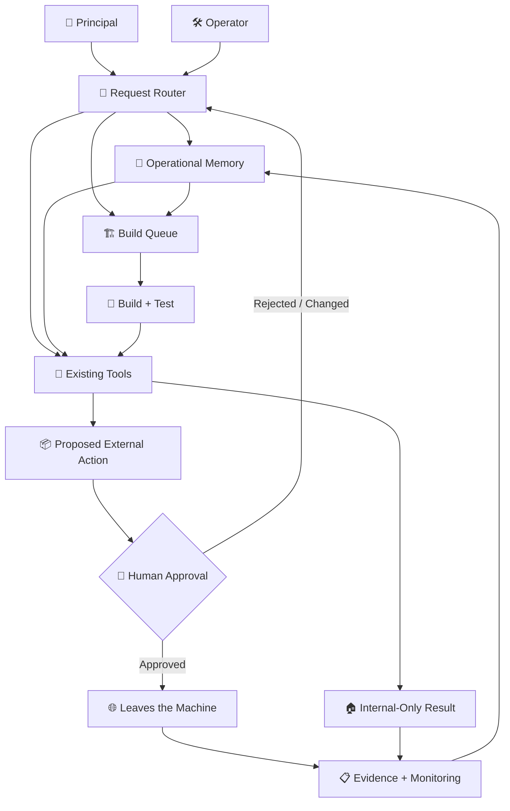

<div align="center">

# 🧠 Corp

**An always-on AI operations layer for a real-world, industry-leading business.**


*Build AI systems that can do useful work without giving them permission to quietly do the wrong thing.*

</div>

---

## 🏢 What this project is

Corp is an always-on AI operations layer built for a real-world, top-performing insurance agency inside a national carrier's captive network.

It is not a chatbot.

It is not an autonomous employee.

It is a system with memory, routing, tools, tests, approval gates, and monitoring, running unattended on a Windows machine inside the client's own environment.

There are two users.

**The principal** runs the business. They talk to the system in plain language, usually from a phone. They do not need to know a command, remember a syntax, choose a model, or understand how the underlying system works.

**The operator** owns the technical side. The operator reviews builds, controls deployment, owns credentials, investigates failures, and controls every exception to the system's safety rules.

Those roles are intentionally different.

The principal should be able to ask for outcomes.

The operator should be able to inspect exactly how those outcomes are produced.

This repository is a sanitised public case study of that architecture. The production vault, business data, credentials, internal records, prompts containing sensitive context, and client-specific integrations remain private.

The client and carrier are **[CONFIDENTIAL]**.

---

## 🗺️ The system at a glance



The important boundary is not between "AI" and "software."

It is between **preparation and consequence**.

The system can reason, retrieve context, prepare work, test tools, and assemble exact payloads internally. Anything externally visible crosses an explicit human approval boundary before it leaves the machine.

---

## 🧰 The toolkit

| | Capability | What it does |
|---|---|---|
| ⭐ | **Review operations** | Collects review context, prepares grounded responses, tracks handling, and keeps the final external action behind approval. |
| 📧 | **Email operations** | Reads permitted inbox context, classifies work, prepares replies, extracts tasks, and routes anything consequential for review. |
| 🎯 | **Lead intelligence** | Evaluates incoming opportunities against defined criteria, records why a lead qualifies or does not, and prepares the next appropriate action. |
| 📊 | **Data-to-decision reporting** | Turns operational data into summaries, exceptions, trends, and decision-ready reports instead of raw exports. |
| 👥 | **Team operations** | Tracks tasks, responsibilities, follow-ups, recurring work, and operational handoffs without requiring the principal to manage the underlying system. |
| 🔁 | **Retention and renewals** | Surfaces upcoming retention work, renewal opportunities, unresolved follow-ups, and context needed for timely intervention. |
| 💰 | **Financial visibility** | Converts permitted business data into operational views of costs, production, opportunities, and other decision-relevant signals. |
| 🧑‍💼 | **Hiring and onboarding** | Organises candidate and onboarding workflows, prepares materials, tracks required steps, and preserves process context. |
| 📄 | **Document handling** | Classifies, extracts, routes, summarises, and retrieves documents while preserving their source and operational context. |
| 🏗️ | **Autonomous tool builder** | Turns repeated work into bounded tools through planning, implementation, adversarial review, testing, and operator-controlled deployment. |
| 🩺 | **Reliability layer** | Watches health, validates invariants, records failures, checks dependencies, and makes silent degradation visible. |

### What each one actually does

The table above is the summary. The mechanism is more specific, and the specifics are where the safety lives.

**⭐ Review operations.** A browser session, held open and signed in, reads new public reviews on a poll. Each one is matched against a roster so a staff member named in a review can be named in the reply, and against the review text itself so nothing in the response asserts a fact the customer did not state first. The draft is written in the principal's voice, learned from her own previous replies rather than from a template. Then it stops.

This is the one place in the system with an armed automatic path, and it was armed deliberately, by hand, after months of drafts being read and approved one at a time. Clean drafts at four stars or above publish themselves ninety minutes after a review is found. Anything flagged, anything negative, anything below that rating still waits for a person. The delay is not a technical requirement; it is a window in which a human can stop it.

**📧 Email operations.** Reads a permitted mailbox over IMAP, classifies what actually needs attention, and writes a reply into the drafts folder.

There is no send path. Not a disabled one, not a flag, not a configuration setting — **the package contains no mail-sending library at all**, and a test walks its syntax tree on every run to prove it. A tool that could send and merely chose not to would be one mistake away from a customer receiving something nobody read.

**🎯 Lead intelligence.** Sources prospects from public data, scores them against written criteria, and records why each one qualified or did not. The reasoning is stored alongside the score, because a number with no argument behind it cannot be checked later and cannot be corrected.

**🔁 Outreach sequencing.** Multi-touch follow-up with hard stops: a maximum number of touches, business hours only, and a reply, bounce or opt-out closes the sequence permanently and irreversibly. Templates are approved by hash — editing one un-approves it automatically and the tool then stages nothing rather than sending unreviewed wording.

The single write it performs anywhere is appending a draft to the drafts folder, flagged as a draft. That is checked structurally: exactly one such call may exist in the package, its folder must come from the drafts lookup rather than any name that could be anything, and it must carry the draft flag. A message appended to a sent folder would read as sent to a human looking at their mailbox, and that is the failure the check exists to catch.

**📊 Data-to-decision reporting.** Turns operational data into exceptions and trends rather than exports. Renders worksheets to images without spreadsheet software, because the machine it runs on does not have any installed and waiting for a licence was not a reason to have no reports.

**👥 Team operations.** Tasks addressed to people by name, never by role — an instruction that reads "the receptionist should" is one nobody owns. Tracks follow-ups and recurring work without requiring the principal to administer the system underneath it.

**🩺 Reliability layer.** Checks run on every interaction and write a short standing brief: what is stale, what is armed, what is running code older than the code on disk, and what number is currently impossible. That last category matters — a metric returning a conversion rate above 100% is listed by name as unquotable rather than quietly reported.

**🧠 Knowledge graph.** Code and operational notes indexed into one structure — several thousand nodes across functions, docstrings, concepts and written decisions. It answers "what calls this", "what breaks if I change it" and "which note explains why this exists" without a text search.

It is also a cautionary tale. It was eleven times larger until a vendored database admin tool was excluded from indexing: 87% of the graph was somebody else's bundled JavaScript, and the honest answer to "what is the most called function in this system" was minified vendor code with thirteen thousand callers, while the real answer had thirty-four. A knowledge graph that indexes everything knows nothing in particular.

The point is not to have the largest toolkit.

The point is to make recurring work **explicit, inspectable, and recoverable**.

---

## 🧠 Memory is part of the product

A useful operations system cannot wake up every morning with amnesia.

Corp uses an Obsidian vault as durable operational memory. The vault holds business context, decisions, operating rules, tool documentation, evidence, and the information required to understand why the system behaves the way it does.

A simplified structure looks like this:

```text
Corp/
│
├── 00 - Start Here/
│   ├── 01 - System Map.md
│   ├── 02 - Operating Rules.md
│   └── 03 - Current Priorities.md
│
├── 01 - Business Memory/
│   ├── 01 - Business Facts.md
│   ├── 02 - Products and Services.md
│   ├── 03 - Team Roles.md
│   └── 04 - Operating Context.md
│
├── 02 - Operations/
│   ├── 01 - Reviews.md
│   ├── 02 - Email.md
│   ├── 03 - Leads.md
│   ├── 04 - Retention.md
│   └── 05 - Team Tasks.md
│
├── 03 - Tools/
│   ├── 01 - Tool Registry.md
│   ├── 02 - Permissions.md
│   └── 03 - Runbooks.md
│
├── 04 - Build Queue/
│   ├── 01 - Requests.md
│   ├── 02 - In Review.md
│   └── 03 - Evidence.md
│
├── 05 - Safety/
│   ├── 01 - Approval Rules.md
│   ├── 02 - Provenance Rules.md
│   ├── 03 - External Action Policy.md
│   └── 04 - Failure Policy.md
│
└── 06 - System/
    ├── 01 - Health.md
    ├── 02 - Change Log.md
    ├── 03 - Incidents.md
    └── 04 - Backups.md
```

Most of the value does not come from thousands of notes.

A small set does most of the heavy lifting:

- **System Map** — what exists and how the pieces connect.
- **Operating Rules** — boundaries the system is not allowed to improvise around.
- **Business Facts** — verified facts the system can rely on.
- **Tool Registry** — what each tool does, requires, and is allowed to touch.
- **Approval Rules** — which actions require a person and what exactly is being approved.
- **Change Log** — what changed, when, and why.
- **Incidents** — failures worth remembering so the system does not relearn the same lesson.

Memory is not an attachment to the system.

It is part of the system.

---

## 🛡️ The safety model

### 1. Prepare, don't dispatch

The default permission is to **prepare work, not publish it**.

Generating an email and sending an email are different capabilities.

Preparing outreach and contacting a person are different capabilities.

Producing a recommendation and changing a business record are different capabilities.

That separation is intentional.

### 2. Approval belongs to the exact payload

"Approved" is not a reusable permission.

If a human approves a specific message, recipient, attachment, or action, the approval belongs to that exact payload.

Change the payload and the approval is no longer valid.

This prevents an approval from silently becoming permission for whatever the system generates next.

### 3. Facts need provenance

Operational memory must distinguish between:

- verified business facts,
- source-derived facts,
- system observations,
- model interpretations,
- and unresolved assumptions.

When a consequential decision depends on a fact, the system should be able to answer:

**Where did this come from?**

A confident model output is not provenance.

### 4. Secrets stay local

Credentials, tokens, private business information, production configuration, and sensitive operational context do not belong in the public repository.

Secrets are stored locally and exposed only to the components that require them.

The AI should not receive broad credentials simply because giving them broad credentials is convenient.

### 5. Failure must be loud

Silence is not reliability.

If an expected job does not run, a dependency disappears, a credential expires, a browser driver fails, an output cannot be validated, or an external service behaves unexpectedly, the system should surface that state.

A failed automation that looks successful is worse than an automation that stops.

### 6. Staging is a real boundary

Testing against production by promising to "be careful" is not staging.

Development and staging must be able to exercise workflows without accidentally producing real-world consequences.

External actions require an intentional transition across that boundary.

---

## 🏗️ How a new tool gets built

```text
Request
  ↓
Clarify the actual business problem
  ↓
Retrieve relevant operational memory
  ↓
Define inputs, outputs and permissions
  ↓
Write acceptance criteria
  ↓
Plan the implementation
  ↓
Build in isolation
  ↓
Run deterministic tests
  ↓
Run integration tests
  ↓
Adversarial review
  ↓
Test failure paths
  ↓
Generate build evidence
  ↓
Operator review
  ↓
Stage
  ↓
Approve deployment
  ↓
Monitor real operation
  ↓
Feed lessons back into memory
```

---

## 🎭 The workers, and why each one exists

Different model perspectives are useful because building and criticising require different incentives. But a model told to be good at everything optimises for nothing, so each worker in the pipeline carries a written identity: what it is accountable for, **what it is allowed to be bad at**, and the specific failure that belongs to it.

That second part is the one that does the work. A reviewer permitted to be undiplomatic will actually disagree. A builder permitted to be slow and verbose will write the plain version instead of the clever one.

| Worker | Optimises for | Allowed to be bad at | The failure that is theirs |
|---|---|---|---|
| 🔍 **Analyst** | Whether the substance came from the operator or from us. If a threshold, a rule or a customer-facing word is not on the record, it asks rather than choosing. | Elegance, brevity, being agreeable. | A spec that reads well and quietly contains a decision nobody made. |
| 📐 **Architect** | The simplest arrangement that satisfies every acceptance criterion and nothing more. Names the state, where it lives, what runs on a schedule, and where a human is required. | Extensibility and generality. It is not designing a framework. | A plan that is impressive to read and painful to build, or one that hides the hard part in a sentence beginning "simply". |
| 🔨 **Builder** | Correctness first, then legibility. Forty plain lines a stranger can read at 2 am beat fifteen clever ones that need explaining. | Speed and line count. Nobody is waiting on it to be quick. | Code that passes its own tests because its tests were written to pass. |
| 🔁 **Cross-checker** | Finding the specific input that breaks it. Empty, None, unicode, a locked database, a file that vanished mid-run, a clock that moved backwards, two copies running at once. | Diplomacy and rewriting. It is not here to make the code its own. | Signing off because it looked fine. "Looks good" is not a review. |
| ⚔️ **Adversary** | The failure, not the confirmation. Defaults to refuted when uncertain. Runs on a **different vendor's model**, which is the entire reason it exists. | Encouragement, and knowing house conventions. | A plausible objection that is wrong, stated as confidently as a real one. That costs a fix cycle and teaches everyone downstream to ignore it. |
| 📝 **Recorder** | What was checked, what was sent back, why, and what is still unresolved. "Sent back because the retry path could double-send on a read timeout" is useful; "sent back for quality" is noise. | Brevity for its own sake, and reassurance. | A smooth account of a rough build. |
| 💅 **Gate** | Whether a real person could use this, and whether it is genuinely good or merely passing. Reads the phase records to find where the build fought itself, because a place that took three cycles to settle is where the remaining bug lives. | Rewriting. It is a gate, not a second builder. | A smooth "all done" that sends a human to find the problem it could have named. |

**Cheap work goes to cheap models.** Moving files, staging, committing and renaming need no judgement, so they do not get an expensive one. Reasoning models are spent on the phases where being wrong is costly.

**Mechanical quality is not a model's job at all.** Dead code, unused imports, import order and formatting are handled by a linter in under a second for nothing. Measured over sixteen real builds, the final quality pass had been spending more than a fifth of total build time doing work a tool does for free. What is left for a model is the judgement, which cannot be linted.

### The one worker that is not a model

The test harness is plain code. It builds a scratch environment, runs the tests as a subprocess, and records the command, the exit code and every byte of output.

This matters more than anything else on this page: **a model cannot report a passing test it never ran, because it never runs one.** Results come back to it as text on the next turn. Every claim about whether something works traces to a recorded subprocess rather than to a model's account of itself.

The honest weakness is the other half of that. The harness runs the tests faithfully, but the model wrote them, so they are exactly as good as that model was that day. Measured, they take thirteen seconds a build. That is the weakest link in the pipeline and it is known rather than hidden.

None of these perspectives gets deployment authority.

"Done" does not mean the code ran once.

Done means the tool has defined behaviour, bounded permissions, tests, failure handling, evidence, documentation, an operator-understood rollback path, and enough monitoring to know when reality stops matching the assumptions it was built under.

---

## 🧪 What real operation taught me

### Built is not the same as useful

A technically working automation can still be useless.

If it solves the wrong problem, requires more attention than the manual process, produces output nobody trusts, or does not fit how the business actually works, shipping more code will not fix it.

Real usage is the test.

### Silence is an error state

Early automation failures taught me that "nothing happened" is not an acceptable result.

If the system expected something to happen, it needs evidence that it happened.

Missing output, missing data, skipped jobs, expired sessions, and broken dependencies need explicit states.

### The reason matters more than the decision

A system saying **NO** is less useful than a system saying:

**NO — because conditions A and B failed, using facts from sources X and Y, under rule Z.**

The same applies to YES.

When humans remain accountable for the outcome, reasoning has to be inspectable.

### Specific context beats generic intelligence

A stronger model without the right business context regularly loses to a simpler system with the correct facts, constraints, examples, tools, and operating history.

The business does not need an AI that knows everything.

It needs a system that knows what is true **here**.

### Human-in-the-loop can still be fast

Human approval does not have to mean copying text between windows and manually reconstructing the AI's reasoning.

The system can do almost everything before the approval boundary: gather context, validate facts, prepare the payload, explain the reasoning, flag uncertainty, and present the decision cleanly.

The human's job can be reduced to making the consequential decision.

That is still automation.

---

## 🔒 What is deliberately private

The public repository does not contain:

- The client's identity.
- The national carrier's identity.
- Staff names or personal information.
- Production credentials, tokens, API keys, cookies, or sessions.
- The production Obsidian vault.
- Customer, prospect, policyholder, or employee data.
- Private emails or communications.
- Production databases.
- Internal carrier systems or documentation.
- Client-specific prompts containing confidential context.
- Exact production network configuration.
- Sensitive operational rules that could expose internal controls.
- Vendor identities where disclosure is unnecessary.
- Raw logs containing business or personal data.
- Anything required to reproduce access to the client's environment.

Where context is necessary to explain the architecture, identifiers are replaced with **[CONFIDENTIAL]** or neutral role names.

---

## 🛣️ Where this goes next

- [ ] Formalise workflow state machines for long-running operations.
- [ ] Move authoritative operational state into a transactional data layer.
- [ ] Expand end-to-end tracing across tools and workflows.
- [ ] Add correlation IDs from request through final outcome.
- [ ] Expand integration and regression test coverage.
- [ ] Build reusable failure-injection tests.
- [ ] Formalise evaluation datasets for model-assisted decisions.
- [ ] Measure model and prompt changes against fixed evaluation sets.
- [ ] Expand role-based and least-privilege access controls.
- [ ] Improve queueing, retry, backoff, and dead-letter handling.
- [ ] Make human approval payloads cryptographically identifiable.
- [ ] Expand operational dashboards and health reporting.
- [ ] Measure cycle time, failure rate, human intervention, and business impact.
- [ ] Keep reducing architectural complexity as capability grows.

---

## 👤 About this repository

I'm Zayah.

I built Corp while working inside a real business and watching where repetitive work, missing context, disconnected systems, and manual decision-making created friction.

The interesting part was never getting an LLM to produce text.

The interesting part was everything around it.

How does the system remember?

How does it know which tool to use?

How does it know what is true?

What happens when a dependency fails?

Who is allowed to approve an action?

What exactly did they approve?

How do I know an unattended process is still healthy?

How do I change the system without quietly breaking something that already works?

How do I give a non-technical person something powerful without making them operate the machinery underneath it?

Corp is my attempt to answer those questions through real operation rather than a demo.

This repository is not the production system.

It is the architecture, patterns, failures, and lessons I can make public without exposing the business that made them possible.

<div align="center">

**Build the system so the human can trust what happens when nobody is watching.**

</div>
